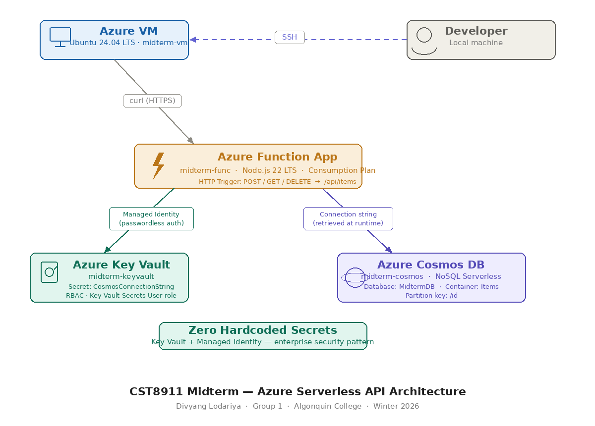

# CST8911 Midterm - Azure Serverless API

**Course:** CST8911-300 Introduction to Cloud Computing  
**College:** Algonquin College | Winter 2026  
**Student:** Divyang Lodariya | Akash Patel | Diniz Martins | Harshdeep Puri | Mohannad Jaber
  
**Scenario:** Scenario 1: -  Serverless RESTful API with Azure Functions, Cosmos DB & Key Vault  

---

## Architecture



> **Zero hardcoded secrets** — Key Vault + Managed Identity used throughout. No connection strings in code.

---

## Azure Services Used

| Service | Resource Name | Purpose |
|---------|--------------|---------|
| Azure Function App | `midterm-func` | Serverless API - Node.js 22 LTS, Consumption plan |
| Azure Cosmos DB | `midterm-cosmos` | NoSQL database - Serverless mode, MidtermDB/Items |
| Azure Key Vault | `midterm-keyvault` | Secret management - stores Cosmos DB connection string |
| Azure Virtual Machine | `midterm-vm` | Testing hub - Ubuntu 24.04, SSH + curl |

---

## API Endpoints

| Method | Route | Description | Status Code |
|--------|-------|-------------|-------------|
| `POST` | `/api/items` | Create a new item | 201 Created |
| `GET` | `/api/items/{id}` | Get item by ID | 200 OK |
| `DELETE` | `/api/items/{id}` | Delete item by ID | 200 OK |
| `GET` | `/api/items` | List all items | 200 OK |

All endpoints require a Function Access Key.

---

## Security Features

- **Managed Identity** - System-Assigned identity on Function App for passwordless Key Vault access
- **Zero hardcoded secrets** - Connection string stored in Key Vault, referenced at runtime via:
  ```
  @Microsoft.KeyVault(VaultName=midterm-keyvault;SecretName=CosmosConnectionString)
  ```
- **Least-privilege RBAC** - Managed Identity granted `Key Vault Secrets User` (read-only) role only
- **Function Access Keys** - All API endpoints are protected against unauthorized access
- **Azure RBAC model** - Used instead of legacy Access Policies
---

## Files

| File | Description |
|------|-------------|
| `index.js` | Main Function App code HTTP trigger with POST, GET, DELETE handlers |
| `function.json` | Function binding config  route, methods, auth level |
| `package.json` | Node.js dependencies (`@azure/cosmos`) |
| `README.md` | This file |

---

## How It Works

1. Developer SSHs into `midterm-vm` (Azure VM, Ubuntu 24.04)
2. `curl` commands sent from VM to Function App over HTTPS
3. Function App uses **Managed Identity** to authenticate to Key Vault (no password)
4. Key Vault returns the Cosmos DB connection string at runtime
5. Function App connects to Cosmos DB and performs the operation
6. JSON response returned to the VM

---

## Test Results (from VM via curl)

| Test | Method | Result |
|------|--------|--------|
| Create item | POST `/api/items` | ✅ 201 - Item created successfully |
| Read item | GET `/api/items/001` | ✅ 200 - Item data returned |
| Delete item | DELETE `/api/items/001` | ✅ 200 - Item deleted successfully |

---

* CST8911-300 Introduction to Cloud Computing *
